# Investing Companion

[](https://github.com/smithadifd/investing_companion/actions/workflows/ci.yml)
[](LICENSE)

Self-hosted equity analysis dashboard with AI-powered insights, real-time alerts, and trade tracking.

| Dashboard | Equity detail |
|-----------|---------------|
| [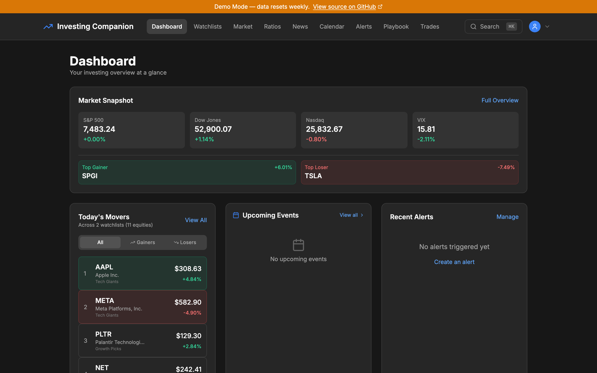](docs/screenshots/dashboard.png) | [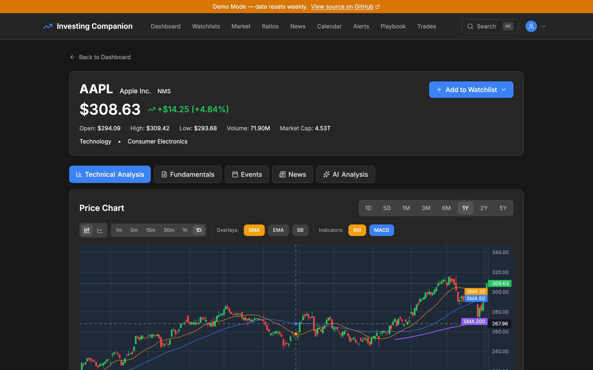](docs/screenshots/equity-detail.png) |
| **Market overview** | **Playbook** |
| [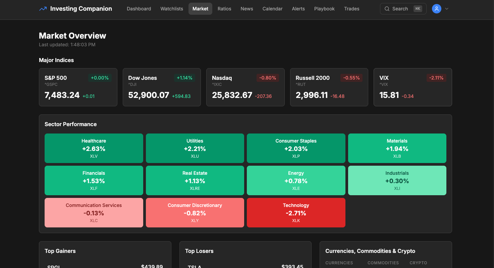](docs/screenshots/market-overview.png) | [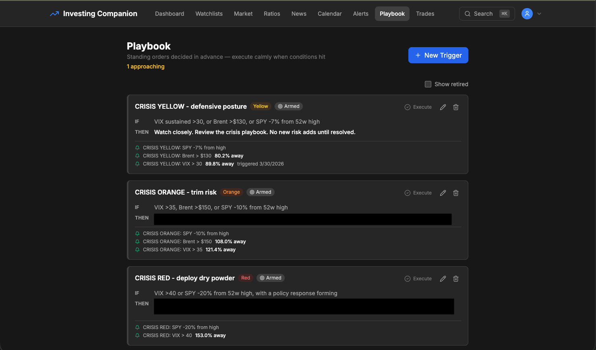](docs/screenshots/playbook.png) |

<details>
<summary>More screenshots</summary>

| Market snapshot | Price chart | Fundamentals |
|-----------------|-------------|--------------|
| [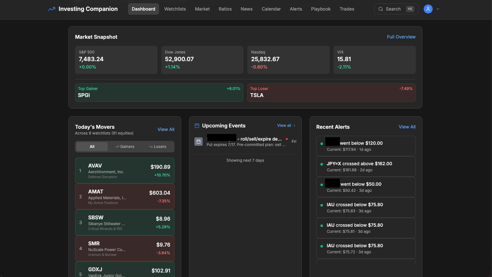](docs/screenshots/dashboard-market-snapshot.png) | [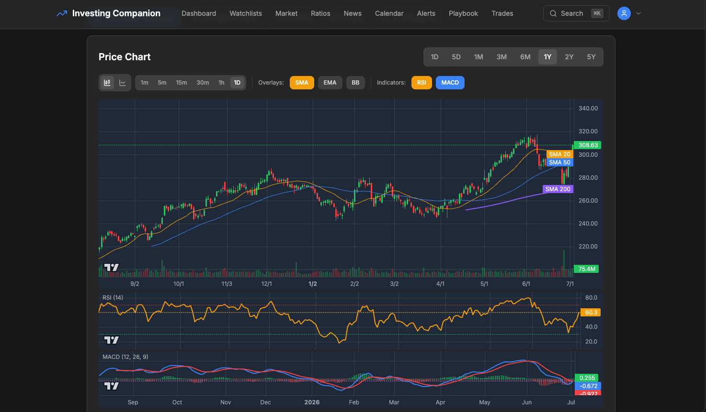](docs/screenshots/equity-price-chart.png) | [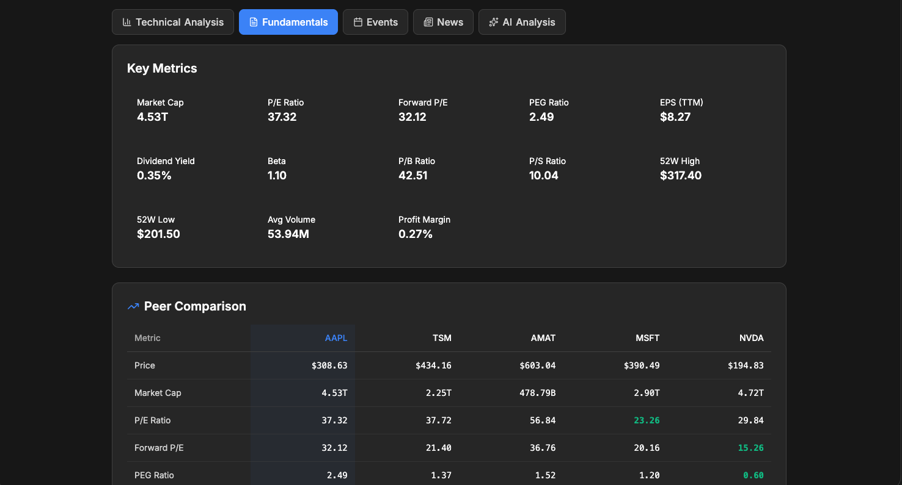](docs/screenshots/equity-fundamentals.png) |

| Ratios | News | Watchlist |
|--------|------|-----------|
| [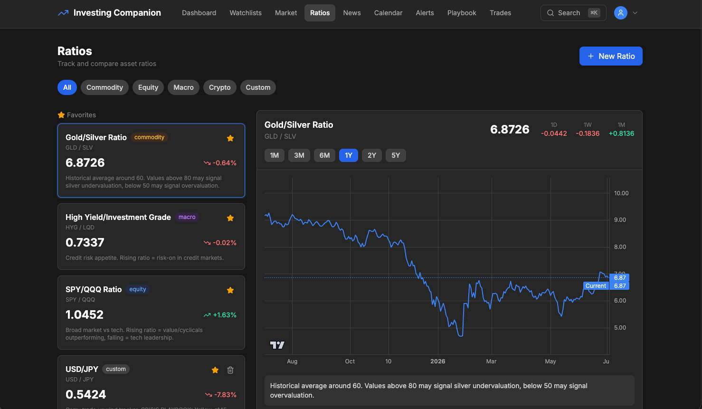](docs/screenshots/ratios.png) | [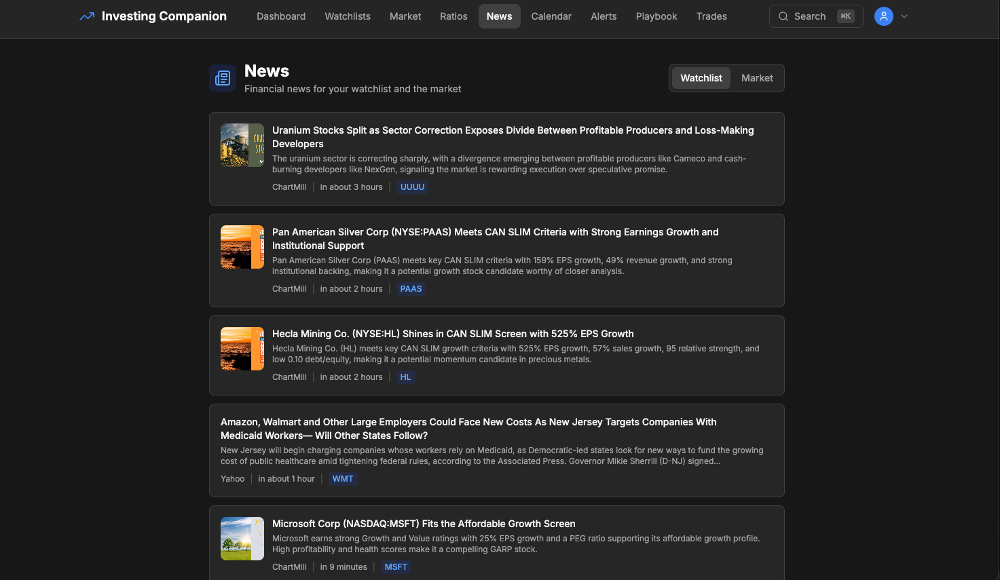](docs/screenshots/news.png) | [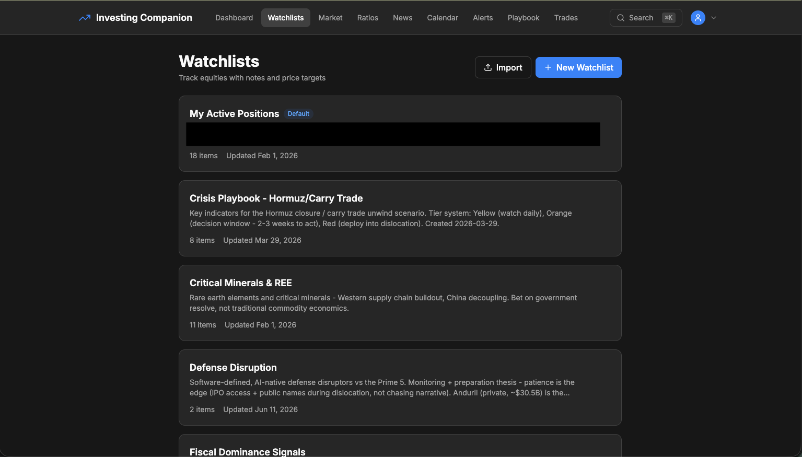](docs/screenshots/watchlist.png) |

| Alerts | Economic calendar | Advisor context packs |
|--------|-------------------|-----------------------|
| [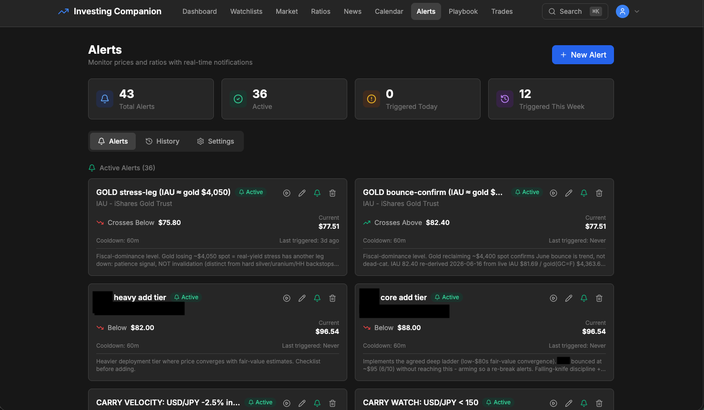](docs/screenshots/alerts.png) | [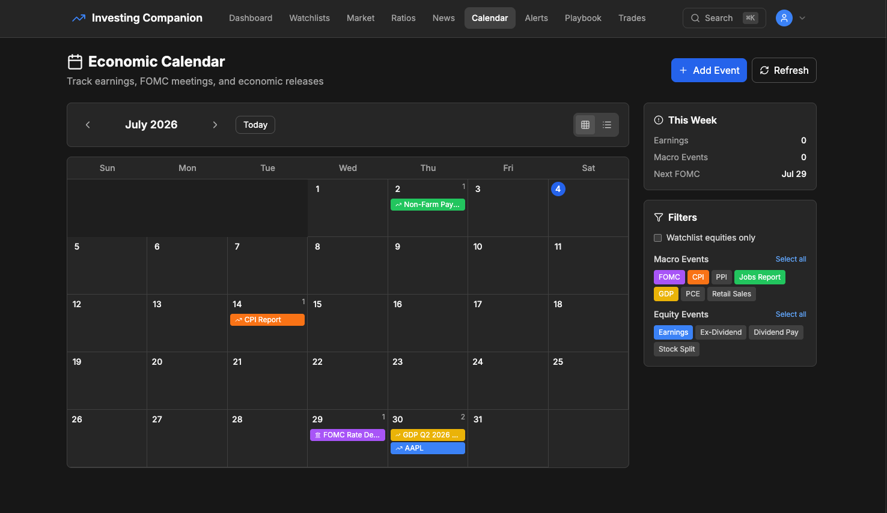](docs/screenshots/economic-calendar.png) | [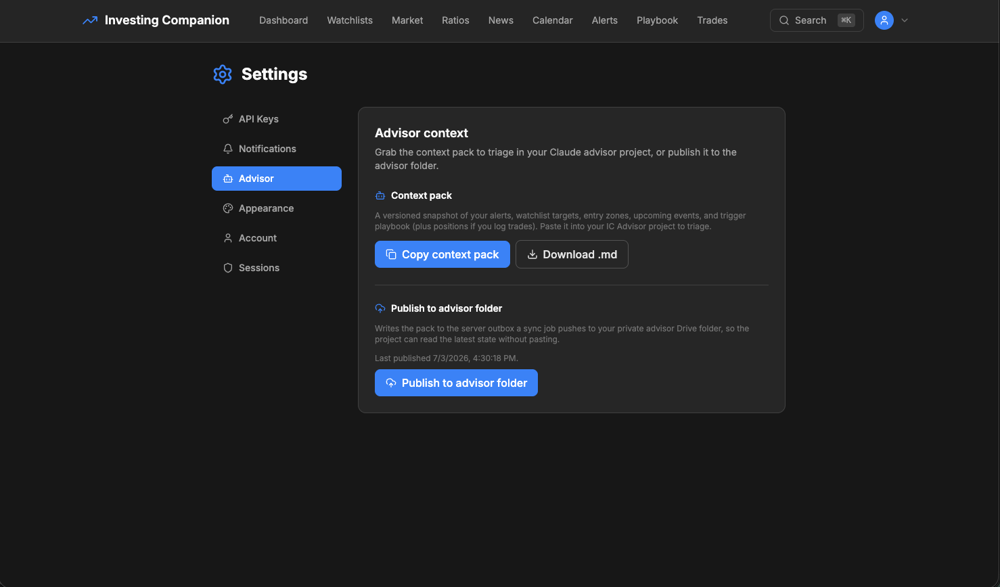](docs/screenshots/settings-advisor-context.png) |

</details>

<sub>Screenshots from the <a href="https://invest.smithadifd.com">live demo</a> in demo mode.</sub>

## Why This Exists

Free tools like Yahoo Finance and Google Finance are fine for checking a stock price, but fall apart when you want to compare ratios across a watchlist, track your actual trades, or get AI-generated analysis that considers your specific holdings. Paid tools (TradingView, Koyfin) are great but expensive for a hobbyist investor. This project fills the gap: a self-hosted dashboard that combines data from multiple sources, runs analysis you care about, and sends alerts to Discord when something moves.

## Live Demo

**[Try it live at invest.smithadifd.com](https://invest.smithadifd.com)**

Log in with `demo@example.com` / `demo1234!` to explore the full dashboard. Data resets weekly and write operations (creating trades, alerts, watchlists) are disabled in demo mode.

## Tech Stack

| Layer | Technology |
|-------|------------|
| Backend | Python 3.11 / FastAPI |
| Frontend | Next.js 16 (App Router) / TypeScript |
| Database | PostgreSQL 15 + TimescaleDB |
| Cache | Redis |
| Task Queue | Celery + Redis broker |
| Charts | TradingView Lightweight Charts |
| AI | Claude API (user-provided key) |
| Notifications | Discord webhooks |
| State | Zustand + TanStack Query |
| Deployment | Docker Compose |

## Architecture

Dual-stack application: Python/FastAPI backend handles data ingestion, analysis, and scheduling; Next.js frontend provides the interactive dashboard.

```
                    +-----------+
                    |  Browser  |
                    +-----+-----+
                          |
                    +-----+-----+
                    |   Caddy   |  (reverse proxy)
                    +--+-----+--+
                       |     |
              +--------+     +--------+
              |                       |
        +-----+-----+          +-----+-----+
        | Next.js 16 |          |  FastAPI   |
        |  Frontend  |          |  Backend   |
        +-----+-----+          +--+--+--+---+
              |                    |  |  |
              +--------+-----------  |  |
                       |             |  |
                 +-----+-----+      |  |
                 | PostgreSQL |      |  |
                 | TimescaleDB|  +---+  +---+
                 +-----------+   |          |
                              +--+--+  +----+----+
                              | Redis|  | Celery  |
                              +-----+  +---------+
```

Data flows through Celery background tasks that pull from Yahoo Finance on a schedule, normalize it, and store it in TimescaleDB hypertables. The frontend reads from the API, never from external sources directly.

## Features

- **Equity Dashboard** -- Search, quote, and chart any publicly traded stock with TradingView charts
- **Watchlists** -- Organize equities into named watchlists with sorting
- **Fundamental Analysis** -- P/E, P/B, dividend yield, market cap, and 20+ financial ratios with cross-equity comparison
- **Market Overview** -- Index tracking (S&P 500, NASDAQ, Dow) with sector heatmaps and daily movers
- **AI Analysis** -- Claude-powered equity analysis that considers price history, fundamentals, and your watchlist context
- **Price Alerts** -- Configurable alerts (price crosses, percent change, volume spike) with Discord notifications
- **Trade Tracker** -- Log trades, calculate P&L, track position sizes, and review trade history
- **Calendar & Events** -- Earnings dates, ex-dividend dates, and macro economic events
- **Scheduled Tasks** -- Celery-powered background jobs for data refresh, alert checking, and daily summaries
- **Authentication** -- Single-user auth with secure password hashing and session management

## Recreate the AI advisor

Beyond the in-app AI analysis, you can stand up an external **investing advisor** -- a Claude
project tuned to your portfolio that reads a live context pack from this app and proposes
changes back through a handoff loop. The [**Advisor Starter Kit**](docs/advisor-starter-kit/)
is a fill-in-the-blanks scaffold for exactly that.

> **In plain English:** the app exports a snapshot of your holdings, watchlists, and ratios;
> you paste it to an AI assistant (e.g. [Claude Code](https://claude.ai/code), a terminal tool
> that can read and act on files); it hands back a structured block of proposed trades and
> alerts; you review it and the app applies the changes. The exact shape of that exchange is
> the [handoff schema](docs/api/handoff-schema.md).

Open the kit in Claude Code and say *"Walk me through `docs/advisor-starter-kit/ONBOARDING.md`"* --
it interviews you and fills the templates. The optional app-integration layer wires the advisor
to this app's read/write contract ([`docs/api/handoff-schema.md`](docs/api/handoff-schema.md) and
[`docs/api/advisor-actions.md`](docs/api/advisor-actions.md)).

## Quick Start

### Docker (recommended)

```bash
git clone https://github.com/smithadifd/investing_companion.git
cd investing_companion
cp .env.example .env

# Edit .env -- set SECRET_KEY, optionally add DISCORD_WEBHOOK_URL and CLAUDE_API_KEY

docker compose up -d

# Run database migrations
docker compose exec api alembic upgrade head
```

The frontend will be at `http://localhost:3000` and the API at `http://localhost:8000` (with interactive docs at `/docs`).

### Local Development

```bash
# Backend
cd backend
python3 -m venv .venv && source .venv/bin/activate
pip install -r requirements.txt
uvicorn app.main:app --reload --port 8000

# Frontend (separate terminal)
cd frontend
npm install
npm run dev
```

Requires Python 3.11+, Node.js 20+, PostgreSQL 15+ with TimescaleDB, and Redis.

## Testing

```bash
# Backend
cd backend && pytest --cov=app

# Frontend
cd frontend && npm test
```

## Data Sources

Market data flows through a resilient provider chain: the primary is wrapped in
retry + exponential backoff + a circuit breaker, and if it is unavailable the
request fails over to a fallback. Data served by a fallback is flagged **stale**
so the UI can show a "delayed data" badge with the source and an "as of"
timestamp.

| Source | Role | Purpose | Auth |
|--------|------|---------|------|
| Yahoo Finance | Primary | Quotes, fundamentals, history, search | None (unofficial) |
| Stooq | Fallback | Quotes + daily history (US equities/ETFs) | **None** |
| Alpha Vantage | Fallback (opt-in) | Quotes | Free API key (`ALPHA_VANTAGE_API_KEY`) |
| Claude API | — | AI-powered analysis | User-provided key |

Stooq needs no key and is always active, so failover works out of the box.
Alpha Vantage is added to the chain only when its key is configured. Polygon.io
remains documented-but-unimplemented (paid tier).

## Support This Project

Investing Companion is free and self-hosted. If it saves you a subscription or you just want to
help keep it maintained, you can chip in:

- [Sponsor on GitHub](https://github.com/sponsors/smithadifd)
- [Buy me a coffee on Ko-fi](https://ko-fi.com/smithadifd)

## License

[MIT](LICENSE)

---

Built with [Claude Code](https://claude.ai/code)
